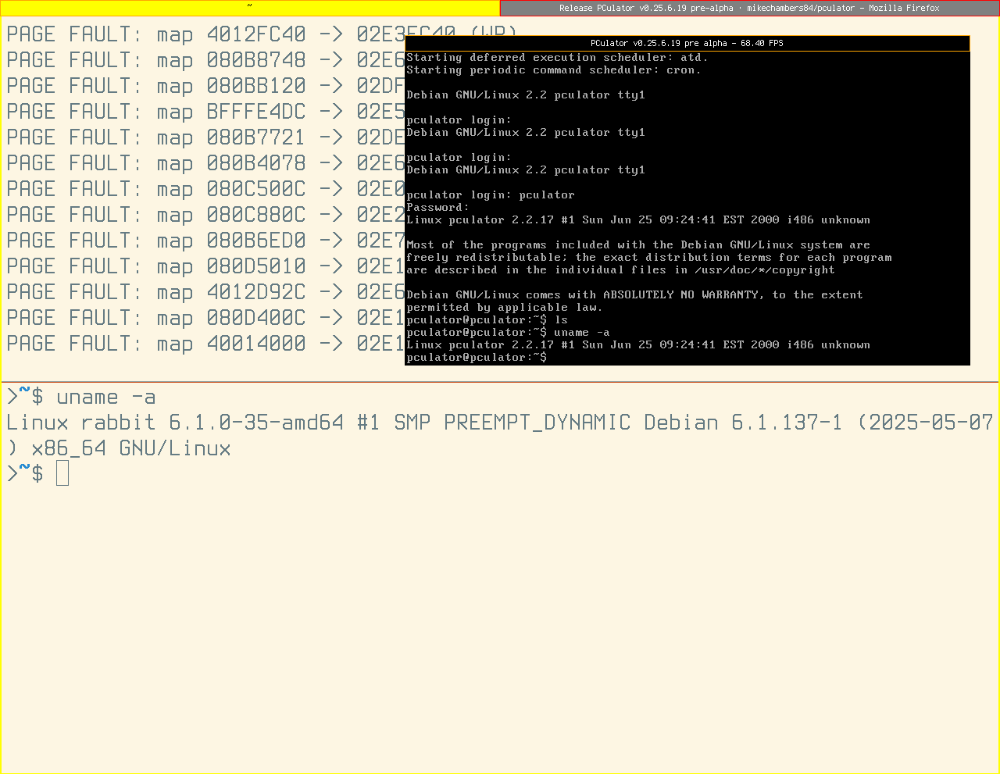

# Linux instructions
Dependencies on Debian 13:
```console
sudo apt install libsdl2-dev libpcap-dev
```

Building:
```console
$ make                # Debug build.
$ make BUILD=debug    # Ditto.
$ make BUILD=release  # Release build.
```

Running:
```console
$ build/release/pculator
PCulator v0.25.6.19 pre alpha (c)2025 Mike Chambers
[A portable, open source x86 PC emulator]

Specify command line parameters. Use -h for help.
```

Running 'potato':
```console
$ 7za e -y PCulator-0.25.6.19-win64.7z -oPCulator-0.25.6.19-win64
$ cd PCulator-0.25.6.19-win64
```

At this point, if you try this:
```console
$ ./pculator -hd0 potato.img
PCulator v0.25.6.19 pre alpha (c)2025 Mike Chambers
[A portable, open source x86 PC emulator]

[ATA] Inserted disk on master channel: potato.img
[MACHINE] Initializing machine: "OPTi 495 Award 486 clone" (award495)
[FS] Opening file at: "roms/machine/award495/opt495s.awa"
[MACHINE] Could not open file, or size is less than expected: roms/machine/award495/opt495s.awa
[ERROR] Machine initialization failure
```

It fails. So we have to fix some paths first:
```console
$ mkdir -p cmos && cp award495.bin cmos/
$ mkdir -p roms/machine/award495 && cp opt495s.awa roms/machine/award495/
$ mkdir -p roms/video && cp et4000.bin roms/video/
$ cp build/release/pculator .
$ ./pculator -hd0 potato.img
```

At this point I got **"KEYBOARD ERROR OR NO KEYBOARD PRESENT"**. Just pressed F1 to continue. For some reason I then got **"DISK BOOT FAILURE, INSERT SYSTEM DISK AND PRESS ENTER"**. Perhaps I got the command invocation wrong. After spamming DEL and fiddling in **"IDE HDD AUTO DETECTION"**, I managed to get a boot!



I can't reproduce either of those errors now, I don't know why.

```
login: pculator
password: pculator
```
